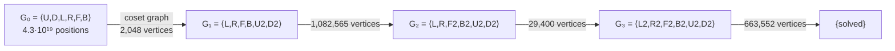

# 02 · Graph-Theory Foundations

This document is the mathematical backbone of the project. Every solver in [07](07-solving-3x3.md) and [08](08-solving-4x4-5x5.md) is an application of one or more of the ideas below. The notation is kept light, and each idea is tied to the code that implements it.

---

## 1. The cube is a Cayley graph

Let **G** be the set of all reachable positions of a cube and **S** the set of moves ("generators"). Since every move has an inverse that is also a move (the inverse of `R` is `R'`), **S = S⁻¹**.

The **Cayley graph** Cay(G, S) has:
- a vertex for every position g ∈ G;
- an undirected edge {g, g·s} for every position g and move s ∈ S.

Properties we rely on:

| Property | Meaning for us |
|---|---|
| **|S|-regular** | Every vertex has exactly |S| neighbours: 18 on the 3×3 (HTM), 27 on our 4×4 move set, 36 on the 5×5. |
| **Undirected** | Because S = S⁻¹. A shortest path from *g* to solved, read backwards and inverted, is a shortest path from solved to *g*. |
| **Vertex-transitive** | The graph looks the same from every vertex. The BFS layers around *solved* have the same sizes as around any other vertex, so a BFS "from the goal" can be reused as a BFS "towards the goal". |
| **Diameter = God's number** | Maximum distance between two positions: **20** for 3×3 in HTM (proved 2010), **11** for 2×2 in HTM. Unknown for 4×4 and 5×5. |

> **Convention.** Moves are applied left to right. After the scramble w = s₁s₂…s_k from solved, the position is g = s₁·s₂·…·s_k. A solution is any word v with g·v = solved. The inverse scramble s_k⁻¹…s₁⁻¹ is always a solution, and it is almost never a short one.

---

## 2. Implicit graphs

We never store V. A graph is represented by two functions:

```text
neighbors(v)  -> iterator of (move, v·move)
is_goal(v)    -> bool
```

Depth-first searches use **O(depth)** memory whatever the graph size. This is why the engine is built around *implicit* graphs (trait `ImplicitGraph` in [06](06-graph-engine.md#2-core-abstractions)).

---

## 3. BFS and the wall it hits

BFS from the solved state visits the graph in layers. Layer *d* is the set of positions at distance exactly *d*. For the 3×3 in HTM:

| d | positions at distance d | cumulative |
|---|---|---|
| 0 | 1 | 1 |
| 1 | 18 | 19 |
| 2 | 243 | 262 |
| 3 | 3,240 | 3,502 |
| 4 | 43,239 | 46,741 |
| 5 | 574,908 | 621,649 |
| 6 | 7,618,438 | 8,240,087 |
| 7 | 100,803,036 | 109,043,123 |
| 8 | 1,332,343,288 | ≈ 1.44 × 10⁹ |

Each layer is about **13.3×** larger than the last. Plain BFS runs out of memory around depth 7–8, and most random positions are at distance 17–18.

**Bidirectional BFS** (meet in the middle) grows one ball around the start and one around the goal and stops when they touch. That turns b^d into about 2·b^(d/2). It is the first genuinely useful trick, and on the 3×3 it solves positions up to about 11 moves in the browser ([07 §2](07-solving-3x3.md#2-raw-graph-search-on-the-full-cayley-graph)). It still can't reach 20.

---

## 4. Quotient graphs: the lower-bound lemma

This is the most important idea in the project.

### 4.1 Coordinates

A **coordinate** is a function π : G → X onto a much smaller set X. For example, "the orientation of the 8 corners" maps 4.3 × 10¹⁹ positions onto |X| = 3⁷ = 2,187 values.

A coordinate is **compatible with the moves** if

```text
π(u) = π(v)   ⇒   π(u·s) = π(v·s)     for every move s.
```

In words: knowing only π(u), you can predict π after any move. Coordinates that look only at *where a chosen subset of pieces sits and how it is twisted* have this property automatically. Every coordinate in the project is of that kind, and each is also checked by a property test ([11](11-testing-and-performance.md)).

### 4.2 The quotient graph

A compatible coordinate defines the **quotient graph** Q_π:
- vertices: the values x ∈ X;
- edges: {π(v), π(v·s)} for every v and s. Self-loops are allowed and ignored.

The map π is a **graph homomorphism** Cay(G,S) → Q_π: it sends each edge to an edge, or collapses it to a single vertex.

### 4.3 The lemma

> **Lower-bound lemma.** For any positions u, w: d_Q(π(u), π(w)) ≤ d_G(u, w).
>
> *Proof.* Map every edge of a shortest u→w path through π. Each maps to an edge or a loop of Q_π, which gives a walk of length ≤ d_G(u, w) from π(u) to π(w). ∎

Taking w = solved:

```text
h_π(v) := d_Q( π(v), π(solved) )    is an ADMISSIBLE heuristic (never overestimates),
and it is CONSISTENT:  |h_π(v) − h_π(v·s)| ≤ 1.
```

Because Q_π is small, we compute h_π for **all** of X with one BFS from π(solved) over Q_π and store it in an array. That array is a **pattern database** (PDB), also called a **pruning table**. Heuristic evaluation then costs one array lookup.

```text
       Cay(G,S): 4.3·10¹⁹ vertices                 Q_π: 2,187 vertices
   ┌───────────────────────────────┐   π    ┌──────────────────────────┐
   │  • • • • • • • • • • • • • •   │ ─────► │   BFS once from π(solved)│
   │  • • • • • • • • • • • • • •   │        │   store dist[x] for all x│
   │  (never stored, only walked)  │        │   h(v) = dist[π(v)]      │
   └───────────────────────────────┘        └──────────────────────────┘
```

### 4.4 Where compatible coordinates come from: cosets

For a subgroup H ≤ G, map every position to its **right coset** Hg. Moves act on cosets by Hg ↦ Hg·s, so this map is compatible by construction. The resulting quotient is the **Schreier coset graph** Sch(H\G, S), with |G|/|H| vertices (the *index* of H). Every coordinate we use is a labelling of the cosets of some subgroup. For example, "corner orientation" labels the cosets of the subgroup that leaves every corner correctly twisted.

### 4.5 Combining heuristics

| Operation | Result | Trade-off |
|---|---|---|
| **max(h₁, h₂)** | still admissible | cheap: two small tables |
| **product coordinate** π₁ × π₂ | a finer quotient, and a stronger heuristic | table size multiplies |
| **symmetry-reduced product** | the product's heuristic in about 1/16 to 1/48 of the memory | more complex indexing (§9) |

Kociemba's small tables use max; his large tables use symmetry-reduced products. [07](07-solving-3x3.md) uses both.

---

## 5. Heuristic search on implicit graphs: IDA\*

**A\*** needs memory proportional to the nodes it visits, and that is fatal here. **IDA\*** (iterative-deepening A\*) runs a depth-first search that prunes any node with f = g + h > threshold, and raises the threshold to the smallest pruned f after each pass. With an admissible h:

- the first solution found is a **shortest** path (in the graph being searched);
- memory is **O(depth)**;
- the work is dominated by the last iteration. Korf, Reid & Edelkamp estimate the number of nodes expanded at depth bound d as Σᵢ Nᵢ · P(d − i), where Nᵢ is the number of nodes at depth i of the brute-force tree and P(k) is the fraction of states with h ≤ k. Stronger heuristics shift P and cut work exponentially.

The engine's IDA\* is written as a **resumable state machine** with an explicit stack ([06 §6](06-graph-engine.md#6-ida)), so the UI can pause, single-step and render it.

---

## 6. Subgroup chains: solving as a sequence of small graph problems

Pick a chain of subgroups

```text
G = G₀ ⊃ G₁ ⊃ G₂ ⊃ … ⊃ G_k = {solved}
```

where each G_i is generated by a restricted move set S_i. **Phase i** starts at a position in G_i and must reach G_{i+1} using only moves in S_i. That is a shortest-path problem in the Schreier coset graph

```text
Sch( G_{i+1} \ G_i , S_i )   with   [G_i : G_{i+1}]  vertices.
```

If each index is small enough to BFS completely, each phase is solved **exactly** by *greedy descent*: repeatedly take any edge that lowers the stored distance. No search is needed. This is **Thistlethwaite's algorithm**. On the 3×3 its four coset graphs have 2,048 / 1,082,565 / 29,400 / 663,552 vertices ([07 §3](07-solving-3x3.md#3-thistlethwaite-four-coset-graphs)).



**Trade-off:** fewer phases give shorter total solutions but bigger coset graphs. Thistlethwaite (4 phases, all tiny) guarantees ≤ 45 moves. Kociemba (2 phases, both huge) reaches about 20 by searching instead of looking up.

---

## 7. Two-phase search: combining many paths

Kociemba's algorithm uses the 2-step chain G ⊃ G₁ = ⟨U, D, R2, L2, F2, B2⟩ ⊃ {solved}:

- **Phase 1** works in Sch(G₁\G, S), which has 2,217,093,120 vertices. That is too many to store directly, so it is searched with IDA\* using PDBs from even smaller quotients.
- **Phase 2** works in Cay(G₁, S₁), which has 19,508,428,800 vertices, again searched with IDA\* and PDBs.

The key point is that the shortest phase-1 path is often not part of the shortest total path. The solver therefore **enumerates phase-1 paths in increasing length** and completes each with a bounded phase-2 search, keeping the best total. That makes it an *anytime* algorithm: the solution length only improves the longer it runs, and the UI plots that improvement ([09](09-visualization.md)).

---

## 8. Parity is connectivity

When you **restrict** the edge set to a subset of moves S' ⊂ S, the graph can split into several **connected components**. A goal in another component cannot be reached, however long you search. What cubers call "parity" is exactly this.

| Situation | Graph | Components |
|---|---|---|
| Disassemble a 3×3 and reassemble it at random | pieces-anywhere graph under face turns | **12** (3 corner-twist classes × 2 edge-flip classes × 2 permutation-parity classes) |
| 4×4 after "reduction" (centres solved, edge pairs matched), then solved with 3×3 turns only | reduced-state graph under outer face turns | **4**: the solved component, "OLL parity" (one flipped edge pair), "PLL parity" (two swapped edge pairs), and both |
| 5×5 edge pairing with half-turn inner slices only | wing-pairing graph | several: this is the "last two edges" parity |

**Our rule (R5):** when designing phase *i*, compute how phase *i+1*'s graph splits into components, and make phase *i*'s goal require landing in the component that contains the final goal. Two mechanisms, both automated ([08 §3](08-solving-4x4-5x5.md#3-parity-lifting-connectivity-requirements-flow-backwards)):

1. **Z₂-invariants by linear algebra.** Permutation parity of a piece orbit is a group homomorphism to Z₂. Write each generator of phase i+1 as a vector of parities over GF(2). The invariants of phase i+1 are the linear functionals that vanish on every generator vector, which is a nullspace computation. Phase *i*'s goal must set those invariants to their solved values.
2. **Component labels by BFS or union-find.** For coordinate spaces small enough to enumerate, label the components of phase i+1's Schreier graph directly. Phase *i* only accepts goal states whose label matches the final goal's.

The same idea validates user-entered cubes. An invalid facelet configuration lies in a component that does not contain *solved*, and the UI explains which invariant separates it ([05 §8](05-cube-model.md#8-validation-is-this-state-solvable)).

---

## 9. Symmetry = graph automorphisms

The cube has 48 spatial symmetries: the full octahedral group O_h, which includes mirror images. Conjugation g ↦ σgσ⁻¹ by a symmetry σ maps the move set onto itself, so it is an **automorphism** of the Cayley graph that fixes *solved*. Consequences:

- d(σgσ⁻¹) = d(g): symmetric positions are equally far from solved.
- Inversion also preserves distance: d(g⁻¹) = d(g).
- A PDB needs to store only **one representative per symmetry class**. Kociemba's phase-1 "flip × slice" coordinate has 1,013,760 raw values but only **64,430** classes under the 16 symmetries that preserve the U/D axis.
- **Extra lookups for free.** h(g), h(g⁻¹) and h(σgσ⁻¹) are all admissible, so take the max.
- **Search from three axes.** Conjugating the start by the rotations that swap the U/D axis with R/L or F/B gives three different searches for the same problem. Running all three and keeping the best shortens Kociemba solutions.
- **Rotation-free output.** A solution containing whole-cube rotations can be rewritten without them by pushing each rotation to the end and conjugating the moves it passes. This is used for the even-sized cubes.

---

## 10. Canonical sequences: removing duplicate paths

Many move sequences reach the same vertex (`U U` = `U2`, and `U D` = `D U`). Searching all of them wastes exponential work. The engine only generates **canonical sequences**:

1. Never turn the same layer set twice in a row.
2. Moves on the same axis commute, so within a run of same-axis moves require a fixed order (for example `U` before `D`, never `D` then `U`). On NxN, *every* pair of turns on the same axis commutes, so a run on one axis must be strictly increasing in layer-mask order.

On the 3×3 this cuts the effective branching factor from 18 to about **13.35**. The rule is stored as a per-move bitmask of allowed next moves ([06 §6.3](06-graph-engine.md#63-canonical-move-filter)).

---

## 11. Glossary

| Term | Meaning |
|---|---|
| **Admissible** | A heuristic that never overestimates the true distance |
| **Cayley graph** | Graph whose vertices are group elements, with an edge for each generator (§1) |
| **Coordinate** | Compatible function from positions to a small integer range (§4.1) |
| **Coset / Schreier graph** | Quotient of a Cayley graph by a subgroup (§4.4) |
| **Consistent** | Heuristic that changes by at most 1 across an edge |
| **God's number** | Diameter of the Cayley graph |
| **HTM / QTM / OBTM / STM** | Half-turn / quarter-turn / outer-block-turn / slice-turn metrics: the rules for what counts as one move |
| **IDA\*** | Iterative-deepening A\* (§5) |
| **Move table** | Precomputed array `coord × move → coord` |
| **PDB / pruning table** | Array of BFS distances in a quotient graph |
| **Phase** | One step of a subgroup chain: reach G_{i+1} from G_i using S_i |
| **Reduction** | Big-cube strategy: make the NxN behave like a 3×3, then solve it as one |
| **Corner / edge / centre** | 3-sticker, 2-sticker, 1-sticker pieces |
| **Midge** | Central edge piece of an odd cube (acts like a 3×3 edge) |
| **Wing** | Non-central edge piece of a 4×4 or larger. Chiral: it has only one possible orientation in each slot |
| **Dedge / tredge** | 4×4 edge pair (2 wings) / 5×5 edge triple (wing, midge, wing) |
| **X-centre / T-centre** | 5×5 centre pieces on the diagonals / orthogonals of a face. All 4×4 centres are X-type |
| **Symmetry reduction** | Storing one representative per automorphism class (§9) |

---

## 12. Further reading

- Jaap Scherphuis, *Jaap's Puzzle Page*: group sizes, Thistlethwaite phase details, invariants.
- Herbert Kociemba, *Cube Explorer* documentation: two-phase algorithm, coordinates, symmetry reduction.
- Richard E. Korf (1997), "Finding Optimal Solutions to Rubik's Cube Using Pattern Databases".
- Korf, Reid & Edelkamp (2001), "Time complexity of iterative-deepening-A\*".
- Rokicki, Kociemba, Davidson & Dethridge (2010/2014), "The Diameter of the Rubik's Cube Group Is Twenty".
- Morwen Thistlethwaite's 52-move (later 45-move) algorithm, as described on Jaap's page.
- Chen Shuang's open-source *min2phase* and *TPR 4×4×4* solvers, and Daniel Walton's *rubiks-cube-NxNxN-solver*, as prior art for multi-phase big-cube reduction.
