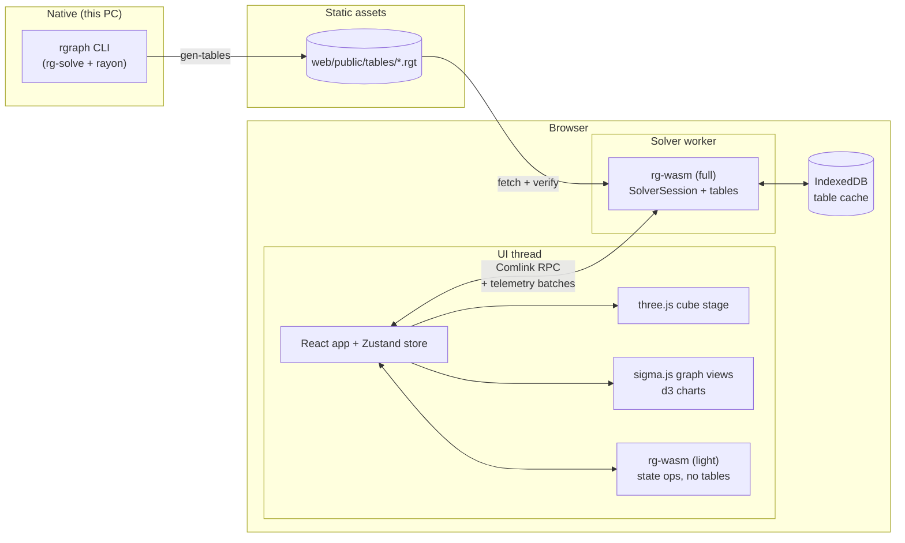
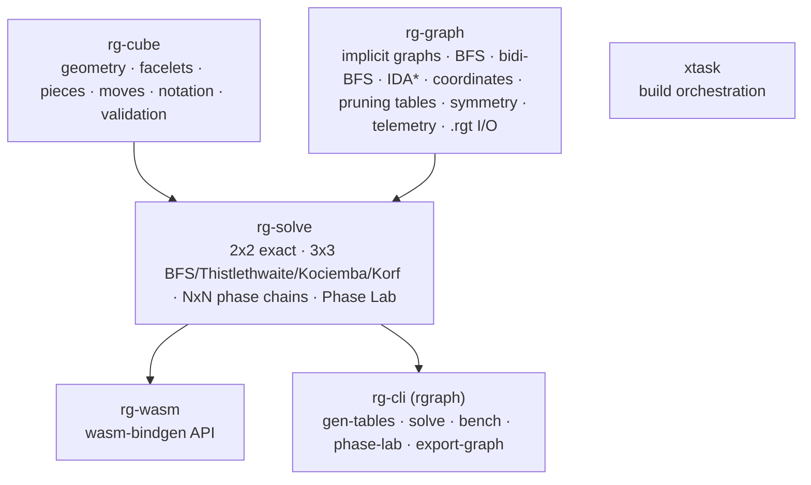
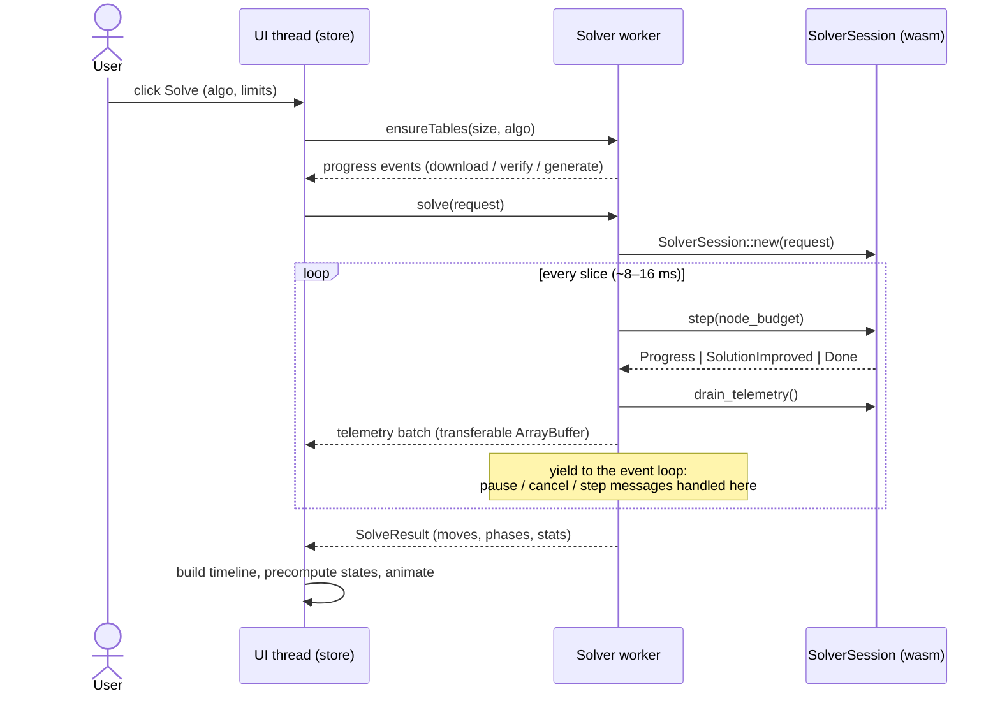
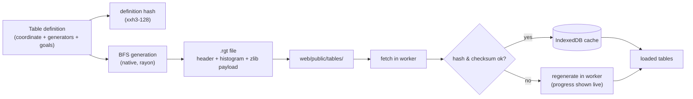

# 04 · System Architecture

## 1. Big picture



- **Native side.** The `rgraph` CLI generates every pruning and move table with all CPU cores and writes them as `.rgt` files into `web/public/tables/`. It also runs benchmarks, the Phase Lab, and batch verification.
- **UI thread.** React holds the application state. The three.js stage and sigma.js/d3 views are imperative renderers driven by that state. A *light* wasm instance (no tables) does synchronous state operations, so turning the cube never waits for the worker.
- **Solver worker.** A *full* wasm instance loads tables and runs solver sessions in small time slices, streaming telemetry back.

---

## 2. Crate layering



**Rules**
1. `rg-graph` does **not** depend on `rg-cube`. The graph engine is puzzle-agnostic and is tested on toy graphs (paths, grids, a small permutation puzzle) as well as cubes. This keeps the algorithms honest and reusable.
2. `rg-cube` knows geometry and nothing about search.
3. `rg-solve` is the only crate that knows both, and it holds all puzzle-specific coordinates and phase definitions.
4. `rg-wasm` and `rg-cli` are thin adapters with no solver logic.
5. Features: `rg-graph/parallel` (rayon, native only), `rg-solve/korf` (large optimal tables), `rg-graph/telemetry` (compiled in for both targets, but zero-cost with `NoopObserver`).

---

## 3. The single source of truth

The cube's semantics (what `R` does, what "solved" means, which positions are legal) exist **only in `rg-cube`**. The UI:
- asks the light wasm instance for the facelet array after each move;
- renders the facelet array, and **never** simulates turns itself;
- animates a turn as pure visual interpolation, then re-syncs colours from the engine (see [09 §2](09-visualization.md#2-v1--cube-stage-3d)).

This removes an entire class of "renderer and engine disagree" bugs.

---

## 4. Anatomy of a solve



---

## 5. Resumable search (why and how)

**Problem.** A wasm call that runs for 3 seconds blocks its worker's event loop, so the UI cannot pause, cancel, or single-step it. Browser threads with shared memory would need cross-origin isolation headers and nightly Rust.

**Decision.** Every search algorithm in `rg-graph` is written as an **explicit-stack state machine** with the signature

```rust
fn step(&mut self, budget: u64) -> StepOutcome; // Progress | Found(..) | Exhausted | Done
```

- **IDA\***: the stack holds frames `{node, g, next_move, last_move}`, and the threshold and next threshold live in the struct.
- **BFS table builders**: a cursor over (depth, index range).
- **Bidirectional BFS**: the frontier cursor plus which side is expanding.
- **Phase chains**: a driver state machine that owns the per-phase searches.

**Benefits**
- **Pause, resume, step N nodes, step one node.** The search-tree visualizer can literally watch IDA\* take one step at a time.
- **Cancel** is just dropping the session (or terminating the worker as a last resort).
- **Deterministic.** The same budget sequence always gives the same results, independent of timing.
- **Adaptive budgets.** The worker measures nodes per millisecond and sizes each slice to about 10 ms.

---

## 6. Telemetry pipeline

Solvers call an `Observer` trait ([06 §9](06-graph-engine.md#9-telemetry-observer-api)). Two implementations exist:
- `NoopObserver`: all methods empty and inlined away. Used for benchmarks and batch runs.
- `RecordingObserver`: aggregates events into bounded buffers.

**Event taxonomy**

| Event | Frequency | Payload | Consumer view |
|---|---|---|---|
| `SessionStart` | once | algorithm, puzzle, phases | pipeline header |
| `PhaseStart` / `PhaseEnd` | per phase | phase id, coordinate sizes, moves found, time | phase pipeline |
| `IterationStart` | per IDA\* threshold | threshold | iteration chart |
| `Counters` | per slice | nodes expanded, pruned, goal tests, nodes/s | stats panel |
| `TreeAggregate` | per slice | counts per (depth, move-prefix) up to depth K, pruned counts | search-tree icicle |
| `NodeSample` | sampled (reservoir) | depth, move path hash, h values, f | scatter / trace |
| `Frontier` | per BFS layer | side, layer, size, memory | bidi frontier view |
| `SolutionImproved` | rare | moves, length, time | anytime chart, timeline |
| `TableProgress` | per BFS layer | table id, depth, filled count | table-generation view |

**Transport.** Aggregates live in wasm memory as flat `u32` arrays. `drain_telemetry()` copies them into a fresh `Uint32Array`, which is posted as a *transferable*, so the copy happens once. Low-frequency events travel as small JSON objects. **Back-pressure:** if the UI hasn't acknowledged the previous batch, the worker merges counters instead of queueing more.

**Bounded memory.** The tree aggregate stores exact counts only for move prefixes up to depth K (default 4 on the 3×3: at most about 40k cells). Deeper nodes add to their depth-K ancestor's bucket.

---

## 7. Memory model

| Consumer | Budget (browser) | Notes |
|---|---|---|
| Light instance (UI thread) | < 16 MB | cube model only |
| Solver worker, 2×2 + 3×3 (Thistlethwaite + Kociemba small tables) | < 64 MB | tables ≈ 10 MB |
| Solver worker, 3×3 Kociemba large tables (optional) | < 128 MB | ≈ 65 MB of tables |
| Solver worker, 4×4 | < 256 MB | see [08 §7](08-solving-4x4-5x5.md#7-table-budget) |
| Solver worker, 5×5 | < 512 MB | browser set uses smaller tables than native |
| Bidirectional BFS | capped by `Limits.max_nodes` | ≈ 40 B per stored state |
| Korf optimal (opt-in) | ≈ 100 MB tables + O(depth) search | native by default |

Tables for a puzzle are loaded **lazily** when that puzzle or algorithm is first selected, and they can be evicted.

---

## 8. Table pipeline



- The **definition hash** covers everything that affects the table's contents: puzzle size, move-set definition, coordinate spec, goal set, and an engine format version. Change any of them and stale tables are rejected automatically.
- **In-browser regeneration** is the fallback, and also a feature: the table-generation view animates BFS layers filling ([09 §12](09-visualization.md#12-v11--table-generation-live)). Small tables (Thistlethwaite, Kociemba small) generate in the browser in about a second anyway. Large ones are native-only by policy.
- The file format is specified in [06 §10](06-graph-engine.md#10-table-file-format-rgt).

---

## 9. Public API sketches

### 9.1 Rust (rg-solve)

```rust
pub enum Algorithm {
    Exact2x2, BidiBfs, Thistlethwaite, Kociemba { tables: KociembaTables }, Korf,
    Reduction4, Reduction5,
}

pub struct SolveRequest {
    pub n: u8,
    pub state: FaceletCube,          // validated before search
    pub algorithm: Algorithm,
    pub limits: Limits,              // max_length, max_nodes, time_budget_ms, target_length
    pub telemetry: TelemetryLevel,   // Off | Counters | Full
}

pub struct SolveResult {
    pub moves: Vec<Move>,
    pub metric_length: u32,
    pub optimality: Optimality,      // Optimal | PhaseOptimal | Suboptimal
    pub phases: Vec<PhaseReport>,    // per-phase moves, nodes, time, coordinate trace
    pub stats: SearchStats,
}

pub trait SolverSession {
    fn step(&mut self, budget: u64) -> SessionStep;   // Progress | Improved(SolveResult) | Done(SolveResult)
    fn drain_telemetry(&mut self, out: &mut TelemetryBuf);
}
```

### 9.2 WebAssembly exports (as seen from TypeScript)

```ts
// light + full instance
export class Cube {
  constructor(n: number);
  static fromFacelets(n: number, facelets: Uint8Array): Cube; // throws ValidationError with reasons
  apply(notation: string): void;
  facelets(): Uint8Array;                 // 6·n² colour indices, U R F D L B order
  pieceMap(): Uint16Array;                // sticker -> piece id (for highlighting)
  lens(lensId: string): Uint8Array;       // projection colouring (09 §4)
  randomState(seed: bigint): void;
}
export function parseAlg(n: number, s: string): Uint16Array; // move ids
export function formatAlg(n: number, ids: Uint16Array, metric: string): string;

// full instance only (worker)
export function loadTable(id: string, bytes: Uint8Array): TableInfo;
export function tablesNeeded(n: number, algorithm: string): string[];
export class Session {
  constructor(requestJson: string);
  step(budget: number): StepResultJson;
  drainTelemetry(): Uint32Array;
}
export function neighborhood(n: number, facelets: Uint8Array, radius: number, heuristics: string[]): GraphPayload;
export function quotientGraph(id: string, maxNodes: number): CsrGraph; // offsets, targets, moveLabels, dist
```

### 9.3 Worker API (Comlink)

```ts
interface SolverWorkerApi {
  ensureTables(n: 2 | 3 | 4 | 5, algo: Algo, onProgress: (p: TableProgress) => void): Promise<void>;
  solve(req: SolveRequest, onEvent: (b: TelemetryBatch) => void): Promise<SolveResult>;
  pause(): void;
  resume(): void;
  stepNodes(n: number): Promise<void>; // single-step mode
  cancel(): void;
  neighborhood(args: NeighborhoodArgs): Promise<GraphPayload>;
  quotientGraph(id: string): Promise<CsrGraph>;
}
```

---

## 10. Error handling

- Library errors are typed enums (`thiserror`). They cross into JS as exceptions carrying `{code, message, details}`.
- **Validation errors are explanatory**, for example: `{code: "CORNER_TWIST", details: {sum_mod_3: 1}}`. The facelet editor maps these to human-readable hints and highlights the offending pieces.
- Panics in wasm are converted to console errors via `console_error_panic_hook`, and the worker reports "engine crashed, restarting" and re-instantiates itself.

---

## 11. Extensibility checklists

**Add a solver**
1. Implement `SolverSession` in `rg-solve`, built from `rg-graph` primitives.
2. Declare its tables (definitions give hashes and generators automatically).
3. Register it in `Algorithm` and in the wasm `Session` factory.
4. Emit phase/iteration events, and add an entry to the comparison dashboard.
5. Add oracle tests and a benchmark.

**Add a coordinate / table**: implement `Coordinate` (rank/unrank), add a congruence property test ([11](11-testing-and-performance.md)), and give it a table definition.

**Add a visualization**: consume existing telemetry events or add one event type, and keep it bounded in size.

**Add a puzzle size (for example 6×6)**: geometry already generalizes. Add oblique centre orbits to the piece classifier and design a phase chain in the Phase Lab.
