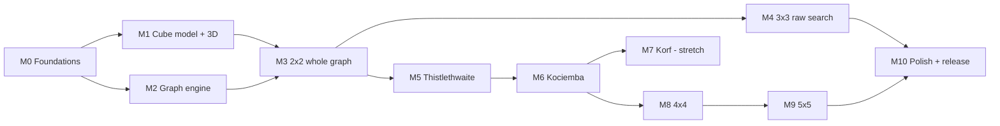

# 10 · Implementation Roadmap

This is the build plan from an empty folder to the finished program. Each milestone ends with something **runnable and visible** and a checklist of **acceptance criteria**. Sizes are relative effort (S < M < L < XL), not calendar estimates.

## Build-order rationale

1. **Visual first (M1).** The 3D cube and net come before any solver, so every later milestone can be seen and debugged visually.
2. **Engine before puzzles (M2).** Graph algorithms are tested on toy graphs, where the correct answers are obvious, before they touch a cube.
3. **Exact oracle early (M3).** The 2×2's complete graph provides exact distances to validate BFS, tables, IDA\* and the visualizers.
4. **Exact before heuristic (M5 → M6).** Thistlethwaite's tables are complete BFS results, so they validate the coordinate machinery before Kociemba's search depends on it.
5. **Tooling before big cubes (M8).** The Phase Lab is built first so that 4×4/5×5 phase boundaries are measured, not guessed.

---

### M0 — Foundations & tooling
**Size:** S · **Goal:** an empty but complete skeleton where every tool works end to end.

Tasks
1. `git init`, `.gitignore` (target/, node_modules/, web/public/tables/, pkg/), `.editorconfig`, LICENSE.
2. Cargo workspace with empty crates `rg-cube`, `rg-graph`, `rg-solve`, `rg-wasm`, `rg-cli` and `xtask`. Edition 2024, shared lints (`clippy::pedantic` selectively), `[profile.release]` with `lto = "thin"`, `codegen-units = 1`, `panic = "abort"` for wasm.
3. `rustup target add wasm32-unknown-unknown`; install `wasm-bindgen-cli` pinned to `Cargo.lock`.
4. `xtask`: `doctor`, `wasm [--watch]`, `tables`, `dev`, `ci`.
5. `web/`: Vite + React + TS (strict) + Tailwind + Zustand + Biome + Vitest. The app shell has the three-panel layout from [09 §1](09-visualization.md#1-layout).
6. Worker plumbing: a module worker plus Comlink, with the wasm module loaded in **both** the main thread and the worker (`hello()` round-trip).
7. CI workflow file (GitHub Actions: fmt, clippy, tests, wasm build, web lint/test/build), ready for when the repo is pushed.

Acceptance
- [ ] `cargo xtask doctor` passes on this machine.
- [ ] `cargo xtask dev` opens the app, and the status bar shows "engine: main ✔ worker ✔" with wasm versions.
- [ ] `cargo xtask ci` passes locally.

---

### M1 — Cube model + 3D viewer
**Size:** L · **Goal:** play with any N = 2…5 in the browser, with the engine as the source of truth.

Tasks
1. `rg-cube` geometry: sticker positions ([05 §2](05-cube-model.md#2-sticker-geometry-doubled-integer-coordinates)), rotation maps, move → gather permutation, move sets per N.
2. Piece classification, orbit cross-check, cubie-level move tables, `Cube3` fast state.
3. Notation parser and formatter (WCA + SiGN subset), `invert`, `simplify`, `strip_rotations`.
4. Piece identification from facelets (wing chirality via the rotation lookup), invariant derivation and validation with explanatory errors.
5. Random state for all N; seeded random-move scrambles.
6. wasm exports: `Cube`, `parseAlg`, `formatAlg`, `lens` (stub).
7. `web/cube3d`: instanced cubies and stickers, animation queue, OrbitControls, keyboard turns, sticker-drag turns.
8. `web/net`: 2D net plus the facelet editor with validation messages.
9. Notation box: type an algorithm and it animates; history with undo.

Acceptance
- [ ] Property tests: for all N and all moves, m⁴ = id, m·m⁻¹ = id; facelet and cubie application agree on random states.
- [ ] 3×3 known orders: `R U` has order 105, and `R U R' U'` has order 6.
- [ ] Derived invariants equal the table in [05 §8](05-cube-model.md#8-validation-is-this-state-solvable) for N = 2…5.
- [ ] Random states always validate; single-corner twists, single-edge flips and 2-piece swaps (where illegal) are always rejected with the correct error code.
- [ ] 60 fps on the 5×5 while animating; spamming keys never desyncs the renderer from the engine.

---

### M2 — Graph engine core
**Size:** L · **Goal:** a puzzle-agnostic engine, proven on toy graphs.

Tasks
1. `combinatorics`: ranking/unranking + binomial tables.
2. `space`/`coord`: traits, move-table builder, congruence test harness.
3. `bfs`: PDB builder (u8/nibble), forward/backward switch, rayon parallel mode, histogram, components, CSR export.
4. `table`: `.rgt` writer/reader, definition hashing, checksum verification.
5. `ida`: resumable IDA\* with canonical filter, composite max heuristic, solution enumeration.
6. `bidi`: resumable bidirectional BFS with streamed last layer and memory caps.
7. `observe`: Observer trait, Noop and Recording observers, telemetry drain format.
8. `invariants`: GF(2)/Z₃ elimination.
9. Toy graphs for tests: path, cycle, grid, hypercube, and the 8-puzzle (a classic IDA\* benchmark with known optimal lengths).

Acceptance
- [ ] BFS distances on toy graphs equal closed-form answers; parallel and sequential builds are byte-identical.
- [ ] IDA\* returns optimal lengths on 1,000 random 8-puzzle instances (checked against BFS).
- [ ] `step(budget)` in arbitrary slice sizes gives identical results to one big step.
- [ ] Criterion benchmark: `NoopObserver` build is within noise of a build with the observer compiled out.

---

### M3 — 2×2: the whole graph
**Size:** M · **Goal:** first real solver, an exact oracle, and the first graph visualizations.

Tasks
1. 2×2 coordinate (7! × 3⁶ index) plus full BFS table (3.67M).
2. Greedy-descent optimal solver as a `SolverSession`.
3. Worker: `ensureTables` (in-browser generation with live progress; V11), `solve`, telemetry.
4. Views: **V6** distance histogram, **V4** neighbourhood graph (exact distances), **V13** heuristic profile, timeline playback.
5. **V10** galaxy view (can slip to M10 if needed).

Acceptance
- [ ] Layer histogram equals the published distribution ([07 §0](07-solving-3x3.md#0-warm-up-the-whole-2x2-graph)); diameter 11.
- [ ] 100,000 random states solved optimally (length equals the table value), each verified on the facelet model.
- [ ] Browser table generation < 2 s, with the live histogram animating.

---

### M4 — 3×3 raw graph search
**Size:** M · **Goal:** show why naive search fails, and solve short positions optimally.

Tasks
1. `Cube3` BFS layer counter (native CLI + browser demo).
2. Bidirectional BFS solver with limits; streamed last layer.
3. **V9** meet-in-the-middle view.

Acceptance
- [ ] Layer counts 0–5 match (CI); 0–7 match natively (ignored-by-default heavy test).
- [ ] Bidi BFS solves all positions at distance ≤ 11 in the browser under the memory cap.
- [ ] Optimality is cross-checked against exact one-sided BFS distances for positions inside the natively explored ball (distance ≤ 7).

---

### M5 — Thistlethwaite + coset explorer
**Size:** L · **Goal:** a complete, fast 3×3 solver built from four fully enumerated coset graphs.

Tasks
1. Coordinates T1–T4, including the generic "coset label by minimum over a small subgroup" construction for T3 ([07 §3](07-solving-3x3.md#3-thistlethwaite-four-coset-graphs)).
2. Exact tables; greedy-descent phase driver (`ChainStrategy::Greedy`).
3. **V3** projection lens (EO, CO, slice, tetrad lenses).
4. **V5** coset-graph explorer (T1 and T3 in full; onion and force layouts).
5. **V8** phase pipeline.

Acceptance
- [ ] Coset graph sizes 2,048 / 1,082,565 / 29,400 / 663,552 and max depths 7 / 10 / 13 / 15.
- [ ] 1,000,000 random states (native) solved, every solution ≤ 45 HTM and verified; distribution of lengths recorded.
- [ ] Browser: tables generated in < 2 s; each solve < 10 ms.

---

### M6 — Kociemba two-phase + search visualizer
**Size:** XL · **Goal:** near-optimal 3×3 solving, and IDA\* made visible.

Tasks
1. Phase-1/2 coordinates, move tables, small PDB tier.
2. Anytime chain driver (`ChainStrategy::Anytime`), boundary rule, time budget, target length.
3. Table pipeline end to end: `rgraph gen-tables`, `.rgt` files served, fetched, verified, and cached in IndexedDB; regeneration fallback.
4. **V7** search-tree icicle, iteration chart, f-strip, step mode.
5. **V12** comparison dashboard (bidi vs Thistlethwaite vs Kociemba).
6. Then: symmetry module + large table tier; three-axis and inverse searches.

Acceptance
- [ ] 10,000 random states (CI) solved and verified; the mean length is recorded for each tier and budget.
- [ ] Targets from [01 §5](01-vision-and-scope.md#5-scope-and-success-criteria): first solution ≤ 24 within 100 ms; ≤ 21 typical within 1 s (browser).
- [ ] Symmetry class counts 64,430 and 2,768; large tables reproduce identical distances to non-reduced tables on sampled entries.
- [ ] Pausing and single-stepping never change the final result (determinism test).

---

### M7 — Korf optimal (stretch)
**Size:** L · **Goal:** provably optimal 3×3 solutions.

Tasks: corner and 2 × 6-edge PDBs (native, rayon); IDA\* with symmetric/inverse lookups; parallel root split; an opt-in browser mode with a depth cap.

Acceptance
- [ ] Superflip solved in exactly 20.
- [ ] For 100 random-move scrambles of length ≤ 11, optimal lengths equal bidi-BFS results.
- [ ] Benchmark of random-state solve times recorded (native).

---

### M8 — 4×4 reduction
**Size:** XL · **Goal:** solve any 4×4, with parity handled by graph connectivity.

Tasks
1. Generalize phases into data: `PhaseSpec` loaded from RON; the chain validator (gates V1–V6, [08 §2](08-solving-4x4-5x5.md#2-the-phase-contract)).
2. **Phase Lab** CLI ([08 §4](08-solving-4x4-5x5.md#4-the-phase-lab)): orbits, sizes, histograms, components, invariants, sampled runs.
3. Rank-on-demand subset coordinates (bitmask + byte-LUT permutations).
4. Phases 4-1…4-3 per [08 §5](08-solving-4x4-5x5.md#5-44-phase-chain); iterate the design with the Phase Lab until all gates pass and the budgets hold.
5. Parity lifting (promoted coordinates / goal filters); 3×3 hand-off with recolouring.
6. Lenses for 4-1…4-3; pipeline with 4 cards; parity explainer (component view).

Acceptance
- [ ] All gates V1–V6 green; 10,000 random 4×4 states solved and verified.
- [ ] Mean ≤ 65 OBTM (aim about 55); p95 time < 10 s in the browser.
- [ ] The 3×3 hand-off validator never fails (it would indicate a lifting bug).

---

### M9 — 5×5 reduction
**Size:** XL · **Goal:** solve any 5×5.

Tasks: the orbit additions (t-centres, midges alongside wings); phases 5-1…5-6 per [08 §6](08-solving-4x4-5x5.md#6-55-phase-chain), with Phase Lab iteration; staged tredge pairing, plus the slice-separation fallback if needed; lenses and pipeline cards.

Acceptance
- [ ] All gates green; 10,000 random 5×5 states solved and verified.
- [ ] Mean ≤ 130 OBTM (aim about 100–110); p95 time < 30 s in the browser; browser table set ≤ 80 MB.

---

### M10 — Polish, performance, release
**Size:** M · **Goal:** a finished, shareable program.

Tasks: V10 galaxy (if deferred); onboarding tour ("what is a Cayley graph?" walkthrough using the live views); accessibility pass (keyboard, colour-blind palette, reduced motion); `wasm-opt` release builds; performance profiling pass; static production build (`pnpm build`) with tables; README quick-start; docs updated to match the implementation.

Acceptance
- [ ] Lighthouse performance ≥ 90 on first load (excluding optional large tables).
- [ ] All CI and nightly suites green; benchmarks recorded in `docs/benchmarks.md`.
- [ ] Every doc in `docs/` matches the implemented behaviour (the decision log is updated for any deviations).

---

## Global definition of done (every milestone)

- Tests for new behaviour, including at least one oracle or property test per new graph.
- `cargo clippy -- -D warnings`, `cargo fmt --check` and `biome check` are clean.
- Every new algorithm emits telemetry, and at least one view consumes it.
- Benchmarks updated where performance-relevant.
- Docs updated; deviations from this design recorded in [12 · Decision log](12-decision-log.md).
